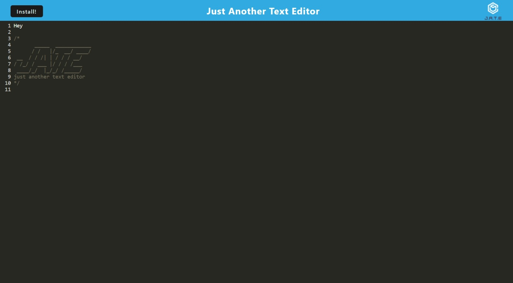

# Text Editor with PWA

## Description
    
A text editor but it uses PWAs to make in more efficient and can be used offline
- Why; To build offline use and efficient coding for mobile use 
- Problem; offline uses
- Knowledge Gained; PWAs and a better understanding of the package json
    
## Table of Contents 
    
- [Installation](#installation)
- [Usage](#usage)
- [Credits](#credits)
- [License](#license)
- [Features](#features)
- [Questions](#questions)
    
## Installation
    
GO to the site  and use the project
    
## Usage
    
https://texteditorpwaheroku.herokuapp.com/
    
    

    
    
## Credits

josh
https://github.com/janorris65
    
nope
    
Third parties; na
    
Tutorials; na
    
## License
    
IBM

https://opensource.org/licenses/IPL-1.0
    
## Features
    
basic text and storage
    
## How to Contribute
    
email me
    
The [Contributor Covenant](https://www.contributor-covenant.org/) is an industry standard, but you can always write your own if you'd prefer.
    
## Questions

Why so simple

Further Questions email at:

janorris65@gmail.com

## Tests
    
use in uncommon browsers.